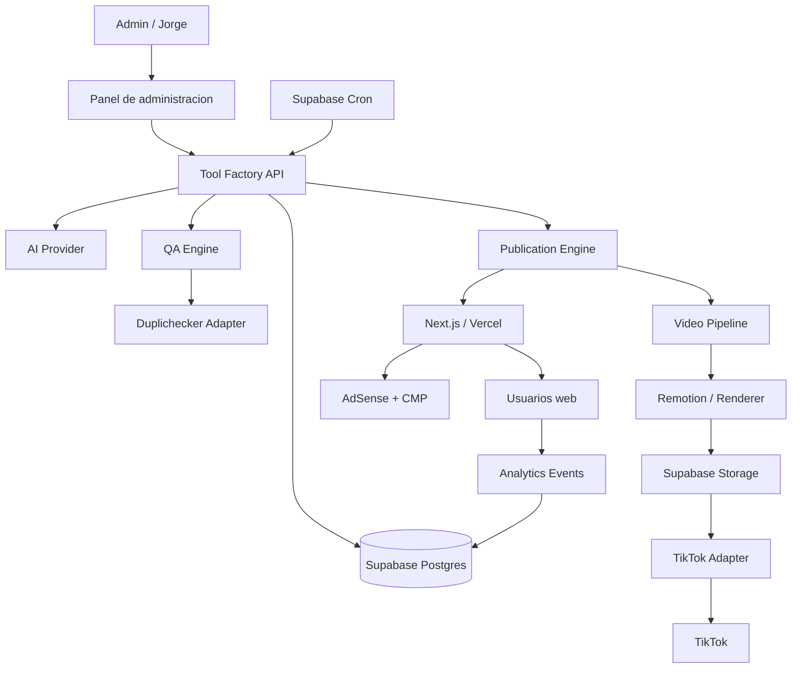
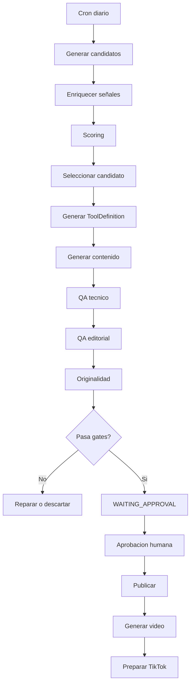

# PRD - Fabrica automatizada de microherramientas monetizadas

**Nombre de trabajo:** MicroTools Factory  
**Destinatario principal:** Codex Astra-6 / agente de desarrollo  
**Propietario de producto:** Jorge  
**Estado:** Documento base para inicio de desarrollo  
**Fecha:** 23 de septiembre de 2026  
**Version:** 1.0

---

## Indice de bloques principales

- Vision, objetivos, principios y stack: secciones 1-6.
- Producto publico y motor de microherramientas: secciones 7-9.
- Fabrica automatica, workflow, jobs y datos: secciones 10-14.
- SEO, contenido, originalidad y AdSense: secciones 15-18.
- Analytics, video, TikTok y administracion: secciones 19-24.
- Repositorio, configuracion, IA y publicacion: secciones 25-33.
- Landing, roadmap, criterios de aceptacion y fallos: secciones 34-38.
- Convenciones, testing, metricas y evolucion: secciones 39-45.
- Orden de ejecucion y prompts para Astra-6: secciones 46-50.

---

## 0. Instruccion de lectura para Astra-6

Este documento es la fuente de verdad inicial del producto. Astra-6 debe utilizarlo como PRD, SDD funcional y contrato de arquitectura para construir la plataforma de forma incremental.

La prioridad no es crear cientos de herramientas desde el primer dia. La prioridad es construir un **motor estable, reutilizable, observable y seguro** que permita incorporar nuevas microherramientas con el minimo cambio de codigo y automatizar posteriormente la generacion, validacion, publicacion, monetizacion y promocion.

Astra-6 debe respetar estas reglas:

1. No duplicar aplicaciones completas para cada microherramienta.
2. No crear un dominio nuevo por herramienta.
3. No introducir dependencias innecesarias si el stack actual puede resolver el problema.
4. No guardar secretos en codigo, repositorio, variables publicas del frontend ni tablas sin proteccion.
5. No publicar automaticamente contenido externo o social cuando una plataforma requiera consentimiento, revision o aprobacion humana.
6. No activar publicidad hasta que el sitio y la cuenta correspondiente esten preparados y aprobados.
7. No permitir que una formula o configuracion generada por IA ejecute JavaScript arbitrario en el navegador o servidor.
8. Todo flujo automatico debe ser idempotente, reintentable y auditable.
9. Toda funcionalidad nueva debe incluir pruebas, logging y criterios de aceptacion.
10. La primera version debe poder funcionar aunque Duplichecker, TikTok o AdSense aun no esten conectados, usando feature flags y adaptadores.

El objetivo de arquitectura es que, una vez construido el core, el propietario pueda pedir:

> "Crea una calculadora de interes compuesto"

Y el sistema pueda incorporar esa herramienta mediante una definicion estructurada, tests y contenido, sin modificar el nucleo salvo que la herramienta requiera una capacidad completamente nueva.

---

# 1. Resumen ejecutivo

Se construira una plataforma web orientada a publicar y monetizar microherramientas utiles: calculadoras, conversores, simuladores, comparadores, estimadores, generadores, tests y utilidades interactivas.

La plataforma se basara en un unico dominio y una arquitectura modular. Cada microherramienta tendra su propia URL indexable y compartible, pero reutilizara el mismo motor, diseño, sistema de contenidos, analitica, anuncios, consentimiento, SEO, video y workflow editorial.

El sistema evolucionara en dos modos de operacion:

- **Modo dirigido:** Jorge indica que herramienta quiere crear. Astra-6 genera su especificacion, implementacion, tests y contenido y la deja lista para revision/publicacion.
- **Modo fabrica:** un proceso programado identifica oportunidades, propone una herramienta, genera borrador, ejecuta QA y deja el paquete preparado para aprobacion. Este modo debe existir en la arquitectura, pero inicialmente permanecera desactivado hasta validar calidad y monetizacion.

El producto debe ser altamente automatizable, pero no ciego. Se mantendran checkpoints humanos en operaciones que puedan afectar cumplimiento, calidad, reputacion o condiciones de APIs externas.

La monetizacion inicial sera Google AdSense. La adquisicion de trafico se apoyara en SEO, enlaces internos y contenido social, especialmente TikTok y posteriormente Reels/Shorts. La generacion de video se automatizara mediante plantillas verticales y un motor de render desacoplado.

---

# 2. Objetivos de producto

## 2.1 Objetivo principal

Crear una plataforma capaz de publicar nuevas microherramientas de alta calidad con un coste marginal muy bajo y con un flujo repetible desde idea hasta distribucion.

## 2.2 Objetivos secundarios

- Concentrar autoridad SEO y monetizacion en un unico dominio.
- Reducir el trabajo manual de crear una nueva herramienta a minutos o segundos.
- Estandarizar calidad visual, UX, accesibilidad, SEO y monetizacion.
- Permitir que la mayoria de herramientas se definan declarativamente.
- Generar automaticamente contenido de apoyo, metadatos SEO y assets sociales.
- Medir cada herramienta como unidad economica independiente.
- Detectar que tipos de herramientas generan trafico, engagement e ingresos y priorizar patrones ganadores.
- Poder desactivar o corregir una herramienta sin redeploy global cuando sea posible.
- Mantener trazabilidad completa de quien genero, reviso y publico cada version.

## 2.3 No objetivos de la primera version

No se pretende en V1:

- Construir un CMS editorial generico equivalente a WordPress.
- Crear automaticamente un dominio por nicho.
- Publicar cientos de paginas programaticas sin revision de calidad.
- Crear una red de sitios satelite.
- Ejecutar codigo arbitrario generado por IA en produccion.
- Automatizar decisiones legales, medicas o financieras de alto riesgo.
- Crear una red social interna.
- Implementar pagos o suscripciones de usuarios finales.
- Sustituir herramientas profesionales reguladas.

---

# 3. Hipotesis de negocio

La hipotesis central es que un catalogo creciente de herramientas interactivas puede acumular trafico procedente de tres fuentes complementarias:

1. **Busqueda organica:** consultas long-tail con intencion concreta.
2. **Social:** videos cortos que plantean una pregunta y llevan a una utilidad.
3. **Descubrimiento interno:** usuarios que navegan desde una herramienta a otras relacionadas.

La monetizacion inicial se calculara a nivel de pagina y herramienta mediante ingresos publicitarios aproximados, RPM, paginas vistas y engagement.

La plataforma no debe asumir que todas las herramientas funcionaran. El modelo debe permitir lanzar, medir y aprender rapidamente. La ventaja competitiva reside en el sistema de produccion y aprendizaje, no en una unica utilidad.

---

# 4. Principios de producto

## 4.1 Una plataforma, muchas herramientas

Todas las herramientas viven bajo un mismo dominio:

```text
https://dominio.com/
https://dominio.com/herramientas/calculadora-porcentajes
https://dominio.com/herramientas/interes-compuesto
https://dominio.com/herramientas/diferencia-entre-fechas
```

## 4.2 Utilidad primero, contenido despues

La herramienta debe ser util aunque el usuario no lea el contenido SEO. El contenido complementario explica, contextualiza y resuelve dudas; no debe existir solo para rellenar palabras.

## 4.3 Configuracion sobre codigo

Cuando una herramienta pueda expresarse mediante inputs, reglas, formulas y bloques de salida, debe crearse mediante configuracion.

Solo herramientas que requieran interacciones complejas, visualizaciones avanzadas o algoritmos especiales deben implementar un componente custom.

## 4.4 Publicar no equivale a indexar

Estados preliminares o de QA deben llevar `noindex`. Solo paginas aprobadas pueden entrar en sitemap e indexacion.

## 4.5 Monetizacion no debe romper UX

Los anuncios nunca deben confundirse con botones, resultados o controles. La calculadora debe seguir siendo inmediatamente usable.

## 4.6 Automatizacion con checkpoints

Los procesos repetitivos se automatizan. Las decisiones que impliquen cumplimiento, reputacion o publicacion externa pueden requerir una aprobacion humana segun configuracion.

---

# 5. Stack objetivo

## 5.1 Frontend y aplicacion web

- Next.js estable, TypeScript estricto.
- Renderizado orientado a SEO: SSR/SSG/ISR segun tipo de pagina.
- Componentes reutilizables.
- CSS utility-first o sistema equivalente, manteniendo consistencia visual.
- Diseño responsive mobile-first.
- Accesibilidad WCAG como criterio de implementacion.

## 5.2 Backend y datos

- Supabase Postgres.
- Supabase Auth para administracion.
- Supabase Storage para assets, capturas y videos.
- Supabase Edge Functions para integraciones y tareas server-side.
- Supabase Cron como scheduler principal.
- Supabase Vault para secretos server-side cuando aplique.

Supabase Cron permite programar jobs y llamar Edge Functions mediante `pg_cron` y `pg_net`. Deben evitarse jobs largos; los procesos pesados deben dividirse en etapas y registrar progreso.

## 5.3 Hosting

- Vercel para aplicacion web.
- Deploy automatico desde Git.
- Preview deployments para ramas/PRs.
- Vercel Cron solo como alternativa o respaldo; el orquestador principal sera Supabase Cron.

## 5.4 IA

Crear una capa `AIProvider` desacoplada. OpenAI sera el proveedor inicial, pero el sistema no debe acoplar logica de negocio a un unico modelo.

La IA se usara para:

- ideacion;
- especificacion de herramientas;
- generacion de contenido;
- clasificacion;
- QA semantico;
- guiones sociales;
- titulos y captions;
- resumen de metricas;
- propuestas de iteracion.

Siempre que sea posible, las respuestas deben usar schemas estructurados y validacion estricta.

## 5.5 Servicios externos previstos

- Google AdSense.
- Google Analytics 4.
- Google Search Console.
- CMP certificada compatible con requisitos de Google para EEE/Reino Unido/Suiza; preferencia inicial: CMP de Google si cubre las necesidades.
- Duplichecker API como comprobacion adicional de originalidad.
- TikTok for Developers / Content Posting API.
- Motor de video basado en Remotion o adaptador equivalente.
- TTS desacoplado mediante interfaz de proveedor.

---

# 6. Arquitectura de alto nivel



---

# 7. Modulos funcionales

## 7.1 Landing publica

La home debe actuar como puerta de entrada y directorio de herramientas.

### Contenido minimo

- Hero con propuesta de valor clara.
- Buscador de herramientas.
- Categorias.
- Herramientas destacadas.
- Herramientas recientes.
- Herramientas mas utilizadas.
- Bloque de explicacion de la plataforma.
- Enlaces a paginas legales.
- Footer global.

### Requisitos

- Carga rapida.
- Indexable.
- Sin dependencia de login.
- Optimizada para movil.
- Navegacion interna fuerte.
- Capaz de funcionar inicialmente con 3 herramientas y escalar a miles.

---

## 7.2 Catalogo y buscador

Rutas sugeridas:

```text
/herramientas
/categoria/:slug
/buscar?q=
```

Filtros:

- categoria;
- popularidad;
- recientes;
- alfabetico;
- tipo de herramienta.

El buscador debe utilizar primero Postgres full-text o mecanismo sencillo. No introducir un motor externo hasta que el volumen lo justifique.

---

## 7.3 Pagina de microherramienta

Cada pagina sigue una plantilla comun.

### Orden recomendado

1. Breadcrumb.
2. H1.
3. Descripcion de 1-3 lineas.
4. Herramienta interactiva.
5. Resultado.
6. CTA secundario para compartir o copiar resultado.
7. Espacio publicitario permitido.
8. Explicacion detallada.
9. Ejemplos.
10. Preguntas frecuentes.
11. Herramientas relacionadas.
12. Fuentes/metodologia cuando corresponda.
13. Fecha de revision en herramientas sensibles al tiempo.

### Reglas de UX

- El usuario debe poder interactuar sin atravesar anuncios.
- Inputs con etiquetas claras, unidades y valores de ejemplo.
- Validacion inmediata.
- Errores comprensibles.
- Boton principal inequívoco.
- Resultado visible y copiable.
- No resetear campos ante errores parciales.
- Compartir URL estable.
- No guardar datos personales introducidos por el usuario salvo consentimiento explicito.

---

# 8. Motor de microherramientas

Este es el componente central.

## 8.1 Dos tipos de herramientas

### Tipo A - Declarativas

Se definen mediante JSON/TypeScript validado:

- metadata;
- inputs;
- validaciones;
- formulas;
- bloques de resultado;
- visualizaciones;
- contenido;
- relaciones.

Ejemplos:

- porcentajes;
- regla de tres;
- interes compuesto;
- conversiones;
- fechas;
- IMC solo como calculo informativo con disclaimer adecuado;
- consumo estimado;
- ahorro mensual.

### Tipo B - Custom

Herramientas que requieren codigo especifico.

Ejemplos:

- simulaciones complejas;
- componentes visuales avanzados;
- algoritmos iterativos;
- editores interactivos;
- utilidades que consumen una API en tiempo real.

Las herramientas custom deben implementar una interfaz comun y no saltarse el pipeline de QA.

---

## 8.2 Tool Definition Schema

Crear un schema versionado. Ejemplo conceptual:

```ts
interface ToolDefinitionV1 {
  schemaVersion: "1.0";
  slug: string;
  status: "draft" | "review" | "published" | "archived";
  title: string;
  shortDescription: string;
  category: string;
  tags: string[];
  locale: "es-ES";
  toolType: "declarative" | "custom";
  inputs: ToolInput[];
  calculation?: CalculationDefinition;
  outputs: ToolOutput[];
  content: ToolContent;
  seo: SeoDefinition;
  monetization: MonetizationDefinition;
  compliance: ComplianceDefinition;
  relatedTools: string[];
  social: SocialDefinition;
  version: number;
}
```

### ToolInput

Debe soportar inicialmente:

- number;
- integer;
- currency;
- percentage;
- text;
- select;
- boolean;
- date;
- duration.

Cada input tendra:

- `id` estable;
- label;
- helpText;
- placeholder;
- defaultValue opcional;
- min/max;
- step;
- required;
- unit;
- validaciones.

---

## 8.3 Motor de formulas seguro

No usar `eval`, `new Function` ni JavaScript generado por IA.

Implementar un DSL restringido o expresiones parseadas mediante libreria segura.

Operaciones permitidas inicialmente:

```text
+ - * / % ^
round floor ceil abs min max
pow sqrt log exp
if/then/else controlado
fechas y diferencias basicas
```

El parser debe validar AST y rechazar:

- acceso a objetos globales;
- propiedades arbitrarias;
- llamadas dinamicas;
- loops;
- imports;
- red;
- filesystem;
- ejecucion de codigo.

Cada formula debe tener tests con casos normales, limites y errores.

---

## 8.4 SDK de herramientas custom

Crear una interfaz equivalente a:

```ts
export interface CustomToolModule {
  id: string;
  version: number;
  Component: React.ComponentType<CustomToolProps>;
  validateDefinition(definition: ToolDefinitionV1): ValidationResult;
  getTestCases(): ToolTestCase[];
}
```

Las herramientas custom deben registrarse explicitamente. No se cargaran modulos remotos arbitrarios.

---

# 9. Flujo de creacion de una nueva herramienta solicitada por Jorge

## 9.1 Entrada

Ejemplo:

> Crea una calculadora de interes compuesto con aportacion inicial, aportacion mensual, rentabilidad anual, años y resultado con capital final, aportado y rendimiento.

## 9.2 Flujo Astra-6 esperado

1. Interpretar requerimiento.
2. Determinar si es declarativa o custom.
3. Generar o actualizar `ToolDefinition`.
4. Implementar formulas.
5. Crear tests unitarios.
6. Crear tests de casos limite.
7. Generar contenido explicativo.
8. Generar SEO metadata.
9. Añadir disclaimers si aplica.
10. Ejecutar QA tecnico.
11. Ejecutar QA de contenido.
12. Ejecutar originalidad si el adaptador esta habilitado.
13. Crear preview.
14. Dejar estado `review`.
15. Mostrar resumen de cambios.
16. Solo tras aprobacion, cambiar a `published`.

## 9.3 Definition of Done por herramienta

Una herramienta no esta terminada hasta que:

- compila;
- no tiene errores TypeScript;
- pasa lint;
- pasa tests;
- pasa validacion del schema;
- funciona en movil y escritorio;
- tiene metadata SEO;
- tiene canonical;
- tiene contenido minimo util;
- tiene enlaces relacionados si existen;
- tiene estado de monetizacion definido;
- tiene nivel de riesgo/compliance definido;
- no contiene secretos;
- tiene analitica de uso;
- aparece correctamente en preview.

---

# 10. Fabrica automatica diaria

La infraestructura se implementara, pero el feature flag `AUTO_FACTORY_ENABLED` sera `false` por defecto.

## 10.1 Flujo diario futuro



## 10.2 Fuentes de ideas

La arquitectura debe soportar adapters para:

- lista editorial manual;
- sugerencias de IA;
- Search Console;
- tendencias publicas;
- analitica interna;
- preguntas relacionadas;
- backlog guardado.

No implementar scraping agresivo como dependencia central.

## 10.3 Opportunity Score

No usar un unico score opaco irreversible. Guardar los componentes por separado.

Ejemplo:

```text
search_intent_score
social_hook_score
ease_of_build_score
evergreen_score
competition_score
monetization_score
internal_link_score
risk_penalty
```

El peso debe almacenarse en configuracion editable.

---

# 11. Workflow y maquina de estados

Estados recomendados:

```text
IDEA
SPEC_GENERATING
SPEC_READY
TOOL_BUILDING
TOOL_TESTING
CONTENT_GENERATING
CONTENT_QA
ORIGINALITY_CHECK
READY_FOR_REVIEW
CHANGES_REQUESTED
APPROVED
PUBLISHING
PUBLISHED
VIDEO_QUEUED
VIDEO_RENDERING
VIDEO_READY
SOCIAL_READY
SOCIAL_PUBLISHED
PAUSED
ARCHIVED
FAILED
```

Cada transicion debe registrar:

- entidad;
- estado anterior;
- estado nuevo;
- timestamp;
- actor humano/sistema;
- job id;
- mensaje;
- metadata tecnica.

---

# 12. Orquestacion de jobs

## 12.1 Principios

- Un job grande se divide en jobs pequeños.
- Cada job tiene `idempotency_key`.
- Reintentos con backoff.
- Maximo de reintentos configurable.
- Estado `FAILED` visible en dashboard.
- No encadenar procesos largos en una sola request HTTP.
- Guardar input/output resumido sin almacenar secretos.

## 12.2 Tabla de jobs

Campos sugeridos:

```text
id uuid
job_type text
entity_type text
entity_id uuid
status text
priority int
attempt_count int
max_attempts int
idempotency_key text unique
payload jsonb
result jsonb
error_code text
error_message text
scheduled_at timestamptz
started_at timestamptz
finished_at timestamptz
created_at timestamptz
```

## 12.3 Scheduler

Supabase Cron ejecutara un dispatcher corto que toma jobs pendientes y lanza Edge Functions especializadas.

No usar Cron como motor de logica complejo. Cron solo despierta procesos.

---

# 13. Modelo de datos Supabase

## 13.1 `tool_definitions`

```text
id uuid PK
slug text unique
title text
category_id uuid
status text
tool_type text
schema_version text
current_version int
risk_level text
is_indexable boolean
is_monetizable boolean
created_at timestamptz
updated_at timestamptz
published_at timestamptz
```

## 13.2 `tool_versions`

```text
id uuid PK
tool_id uuid FK
version int
definition jsonb
content_hash text
created_by text
change_summary text
created_at timestamptz
```

Unique `(tool_id, version)`.

## 13.3 `categories`

```text
id uuid
slug text unique
name text
description text
seo_title text
seo_description text
sort_order int
is_active boolean
```

## 13.4 `ideas`

```text
id uuid
source text
title text
summary text
status text
scores jsonb
raw_signals jsonb
selected_reason text
created_at timestamptz
```

## 13.5 `qa_runs`

```text
id uuid
entity_type text
entity_id uuid
qa_type text
status text
score numeric
checks jsonb
model text
created_at timestamptz
```

## 13.6 `originality_checks`

```text
id uuid
tool_version_id uuid
provider text
status text
unique_percent numeric
exact_match_percent numeric
rephrased_percent numeric
provider_reference text
raw_summary jsonb
created_at timestamptz
```

No guardar respuestas externas completas si contienen informacion innecesaria.

## 13.7 `publication_events`

```text
id uuid
tool_id uuid
tool_version_id uuid
environment text
status text
url text
commit_sha text
deployment_id text
published_at timestamptz
```

## 13.8 `video_jobs`

```text
id uuid
tool_id uuid
status text
template_id text
script jsonb
render_config jsonb
storage_path text
duration_seconds numeric
created_at timestamptz
finished_at timestamptz
```

## 13.9 `social_posts`

```text
id uuid
tool_id uuid
platform text
status text
video_job_id uuid
caption text
hashtags text[]
external_post_id text
privacy_setting text
requires_human_consent boolean
scheduled_at timestamptz
published_at timestamptz
error_message text
```

## 13.10 `analytics_daily`

```text
id uuid
date date
tool_id uuid
page_views bigint
unique_users bigint
tool_starts bigint
tool_completions bigint
share_clicks bigint
outbound_clicks bigint
avg_engagement_seconds numeric
source_breakdown jsonb
```

## 13.11 `revenue_daily`

```text
id uuid
date date
tool_id uuid nullable
provider text
estimated_revenue numeric
page_views bigint
page_rpm numeric
impressions bigint
clicks bigint
raw_summary jsonb
```

## 13.12 `system_settings`

Clave/valor tipado para:

- feature flags;
- scoring weights;
- QA thresholds;
- publishing policy;
- video defaults;
- social defaults.

## 13.13 `audit_log`

Registrar acciones administrativas y automaticas relevantes.

---

# 14. Seguridad y RLS

## 14.1 Reglas

- Usuarios publicos: solo lectura de herramientas `published`.
- Admin autenticado: CRUD segun rol.
- Service role solo en backend seguro.
- Nunca exponer `SUPABASE_SERVICE_ROLE_KEY` al cliente.
- TikTok refresh tokens, API keys y secretos en Vault o almacenamiento cifrado server-side.
- Logs deben redactar tokens.
- Aplicar rate limiting a endpoints costosos.

## 14.2 Datos introducidos por usuarios

Por defecto, los inputs de calculadoras se procesan localmente en cliente si no necesitan backend.

No almacenar:

- salarios;
- datos medicos;
- fechas personales;
- identificadores;
- texto libre sensible;

salvo que la funcionalidad lo requiera y exista una politica especifica.

Para analitica, registrar eventos genericos como `tool_completed`, no el contenido del formulario.

---

# 15. SEO tecnico

## 15.1 Por herramienta

Cada herramienta publicada debe tener:

- URL estable y legible;
- `title` unico;
- meta description;
- canonical;
- Open Graph;
- Twitter/X card generica si aplica;
- H1 unico;
- jerarquia H2/H3;
- sitemap;
- robots coherente;
- datos estructurados apropiados cuando sean validos;
- breadcrumbs;
- enlaces internos.

## 15.2 Sitemap

Generar sitemaps dinamicos por bloques si el volumen crece.

Solo incluir:

- `published`;
- indexables;
- canonical propio;
- HTTP 200.

## 15.3 Drafts

Cualquier preview o borrador:

```text
noindex, nofollow
```

si es accesible externamente.

## 15.4 Contenido programatico

No generar miles de paginas por combinacion de parametros. Cada URL indexable debe corresponder a una utilidad o intencion real.

---

# 16. Contenido editorial

## 16.1 Bloques por herramienta

El schema de contenido debe soportar:

- introduccion;
- como usar;
- como se calcula;
- ejemplo;
- interpretacion;
- limites;
- FAQ;
- metodologia;
- fuentes;
- disclaimer.

## 16.2 Reglas de calidad

- Evitar texto generico repetitivo.
- No copiar estructuras completas de competidores.
- No afirmar datos que dependan del tiempo sin fuente y fecha de revision.
- Separar calculo matematico de consejo profesional.
- Usar lenguaje claro.
- Revisar contenido de alto impacto.

## 16.3 YMYL y riesgo

Definir `risk_level`:

```text
LOW
MEDIUM
HIGH
BLOCKED
```

### LOW

Matematicas, conversiones, productividad, fechas, ocio.

### MEDIUM

Finanzas personales simples o fitness informativo con formulas conocidas, siempre con contexto y disclaimer.

### HIGH

Fiscalidad, prestaciones, salud, legal, inversion, credito regulado, datos que cambian con normativa.

Requiere:

- fuentes oficiales;
- `last_reviewed_at`;
- revision humana obligatoria;
- no autopublicacion.

### BLOCKED

Cualquier utilidad cuya salida pueda facilitar daño, fraude, evasion, diagnostico clinico automatico o decisiones reguladas no adecuadas para el sitio.

---

# 17. Comprobacion de originalidad / Duplichecker

Crear interfaz:

```ts
interface OriginalityProvider {
  check(text: string, options?: OriginalityOptions): Promise<OriginalityResult>;
}
```

Implementacion inicial opcional: `DuplicheckerProvider`.

Duplichecker dispone de API de plagiarism checker y contempla deteccion de texto reformulado cuando se solicita. El acceso a API requiere un plan compatible.

## 17.1 Politica

El resultado de Duplichecker no es una prueba absoluta de calidad. Es un gate complementario.

Thresholds configurables, por ejemplo:

```text
exact_match_percent <= 5
rephrased_percent <= 15
```

Los valores finales se ajustaran con experiencia.

Si falla:

1. marcar `CONTENT_REWRITE_REQUIRED`;
2. pasar coincidencias relevantes al proceso de reescritura sin copiar fuentes;
3. regenerar;
4. repetir una vez;
5. si vuelve a fallar, revision humana.

Evitar bucles infinitos.

---

# 18. Google AdSense

## 18.1 Integracion

La aplicacion debe soportar dos modos:

```text
ADS_DISABLED
ADSENSE_AUTO_ADS
```

Posteriormente se puede añadir modo manual/hibrido.

AdSense Auto Ads permite usar el mismo codigo base en las paginas del sitio y ajustar automaticamente ubicaciones conforme cambian las paginas.

## 18.2 Requisito de sitio

El dominio debe añadirse a AdSense, verificarse y pasar revision antes de servir anuncios. La aplicacion no debe asumir que colocar el script equivale a estar aprobado.

## 18.3 Implementacion tecnica

Variables:

```text
NEXT_PUBLIC_ADSENSE_PUBLISHER_ID
ADS_ENABLED
```

Crear componente global:

```text
<AdSenseScript />
```

que solo se cargue cuando:

- entorno production;
- feature flag activo;
- publisher id configurado;
- consentimiento aplicable gestionado correctamente.

## 18.4 Ads.txt

Generar `/ads.txt` configurable.

No hardcodear un publisher id de prueba.

## 18.5 CMP y consentimiento

Para trafico del EEE, Reino Unido y Suiza, Google exige una CMP certificada integrada con TCF para anuncios personalizados. La plataforma debe incluir desde el inicio una capa de consentimiento compatible.

Preferencia MVP:

- utilizar la CMP proporcionada/gestionada desde Google AdSense si resulta suficiente;
- mantener el codigo preparado para una CMP externa certificada.

## 18.6 Reglas de posicionamiento

Nunca colocar anuncio:

- dentro del formulario;
- pegado a un boton de calcular;
- simulando un resultado;
- de forma que provoque clic accidental.

La monetizacion no debe degradar la interaccion principal.

---

# 19. Analytics y medicion

## 19.1 Eventos minimos

```text
page_view
tool_view
tool_start
tool_submit
tool_complete
tool_error
result_copy
share_click
related_tool_click
ad_slot_viewable opcional
social_cta_click
```

## 19.2 Propiedades de evento

Permitidas:

```text
tool_slug
category
version
source
campaign
viewport_group
```

No enviar valores sensibles introducidos por el usuario.

## 19.3 Funnel por herramienta

```text
page_view -> tool_start -> tool_complete -> share/related
```

Metricas:

- completion rate;
- tiempo hasta completar;
- errores por input;
- paginas vistas;
- recurrencia;
- CTR interno;
- trafico organico;
- trafico social;
- RPM estimado;
- ingresos estimados por herramienta.

---

# 20. Video social automatizado

## 20.1 Objetivo

Generar un video vertical 9:16 por herramienta con una plantilla reutilizable.

No depender de video generativo caro para el flujo diario.

## 20.2 Estructura de video

Duracion objetivo inicial: 15-30 s.

Escenas:

1. Hook.
2. Problema/pregunta.
3. Demostracion rapida de la herramienta.
4. Resultado ejemplo.
5. CTA.

## 20.3 VideoDefinition

```ts
interface VideoDefinition {
  toolSlug: string;
  templateId: string;
  hook: string;
  scenes: VideoScene[];
  voiceover?: string;
  captions: CaptionCue[];
  cta: string;
  durationTarget: number;
  locale: string;
}
```

## 20.4 Plantillas

Crear inicialmente 3 plantillas:

- calculadora numerica;
- comparador;
- generador/test.

Evitar marcas de agua promocionales no permitidas por la plataforma destino.

## 20.5 Render

Crear `VideoRenderer` desacoplado:

```ts
interface VideoRenderer {
  render(definition: VideoDefinition): Promise<RenderedVideo>;
}
```

Implementacion inicial puede ser Remotion.

El render pesado debe ejecutarse fuera de una request web normal.

Guardar MP4 final en Supabase Storage con path versionado.

---

# 21. TikTok

## 21.1 Integracion

Crear un `TikTokPublisher` aislado.

El Content Posting API de TikTok requiere una app registrada y permisos correspondientes. Para Direct Post, el flujo debe consultar informacion actual del creador, mostrar opciones relevantes y obtener consentimiento antes del envio.

Los clientes no auditados tienen restricciones y sus publicaciones mediante Direct Post quedan limitadas a visibilidad privada; la publicacion publica automatizada requiere superar el proceso de auditoria correspondiente.

Por tanto, implementar tres modos:

```text
TIKTOK_DISABLED
TIKTOK_DRAFT_OR_PRIVATE
TIKTOK_DIRECT_POST_AUDITED
```

## 21.2 V1

Objetivo V1:

- generar video;
- generar caption y hashtags;
- mostrar preview;
- permitir aprobacion;
- si API disponible, enviar mediante flujo autorizado;
- si no, dejar paquete descargable/operable manualmente.

No bloquear el lanzamiento web por TikTok.

## 21.3 Tokens

- OAuth.
- Refresh tokens server-side.
- Cifrado/Vault.
- Nunca localStorage para tokens sensibles de publicacion.

---

# 22. Panel de administracion

Rutas protegidas:

```text
/admin
/admin/tools
/admin/tools/:id
/admin/ideas
/admin/review
/admin/jobs
/admin/videos
/admin/social
/admin/analytics
/admin/settings
```

## 22.1 Dashboard

Mostrar:

- herramientas publicadas;
- borradores;
- pendientes de revision;
- jobs fallidos;
- videos pendientes;
- visitas ultimos 7/30 dias;
- top herramientas;
- ingresos estimados si disponibles;
- RPM medio;
- herramientas con caida de rendimiento.

## 22.2 Review screen

Debe permitir en una sola pantalla:

- preview escritorio/movil;
- ToolDefinition resumida;
- formulas;
- casos de test;
- checks QA;
- originalidad;
- contenido;
- metadata SEO;
- riesgo/compliance;
- guion social;
- aprobar;
- solicitar cambios;
- archivar.

---

# 23. QA automatico

## 23.1 QA tecnico

- schema valido;
- slug valido;
- formulas parseables;
- tests pasan;
- no division no controlada por cero;
- limites razonables;
- sin NaN/Infinity;
- accesibilidad basica;
- responsive;
- sin errores console;
- enlaces validos internos;
- metadata presente.

## 23.2 QA de contenido

Checks:

- titulo consistente;
- descripcion no duplicada;
- texto util;
- no claims sin respaldo cuando requieran fuente;
- no consejos de alto riesgo sin control;
- no menciones a competidores innecesarias;
- no prompt leakage;
- no contenido ofensivo o irrelevante;
- no instrucciones del modelo visibles.

## 23.3 QA visual

Automatizar capturas de:

- mobile 390px;
- tablet;
- desktop 1440px.

Detectar al menos:

- overflow horizontal;
- elementos cortados;
- botones fuera de viewport;
- resultados invisibles;
- skeleton infinito;
- errores 500/404.

---

# 24. Feature flags

Crear sistema simple de feature flags en `system_settings`.

Flags iniciales:

```text
AUTO_FACTORY_ENABLED=false
ADS_ENABLED=false
DUPLICHECKER_ENABLED=false
VIDEO_AUTOGEN_ENABLED=false
TIKTOK_ENABLED=false
AUTO_SOCIAL_PUBLISH_ENABLED=false
AUTO_WEB_PUBLISH_ENABLED=false
HIGH_RISK_TOOLS_ENABLED=false
```

El sistema debe funcionar con todos en `false` salvo funcionalidades core.

---

# 25. Estructura de repositorio propuesta

```text
/
├─ apps/
│  └─ web/
│     ├─ app/
│     │  ├─ (public)/
│     │  ├─ herramientas/
│     │  ├─ categoria/
│     │  └─ admin/
│     ├─ components/
│     └─ lib/
├─ packages/
│  ├─ tool-engine/
│  ├─ tool-sdk/
│  ├─ tool-schemas/
│  ├─ content-engine/
│  ├─ ai-provider/
│  ├─ qa-engine/
│  ├─ originality/
│  ├─ analytics/
│  ├─ ads/
│  ├─ video-engine/
│  └─ social-publishers/
├─ supabase/
│  ├─ migrations/
│  ├─ functions/
│  │  ├─ job-dispatcher/
│  │  ├─ generate-tool-spec/
│  │  ├─ generate-content/
│  │  ├─ run-content-qa/
│  │  ├─ run-originality-check/
│  │  ├─ publish-tool/
│  │  ├─ generate-video-spec/
│  │  └─ tiktok-publish/
│  └─ seed.sql
├─ tools/
│  ├─ definitions/
│  └─ custom/
├─ tests/
│  ├─ e2e/
│  └─ fixtures/
├─ docs/
│  ├─ PRD.md
│  ├─ ARCHITECTURE.md
│  ├─ TOOL_AUTHORING.md
│  ├─ RUNBOOK.md
│  └─ SECURITY.md
└─ README.md
```

Si Astra-6 determina que un monorepo añade complejidad innecesaria en la primera iteracion, puede mantener una unica app con modulos internos, pero debe conservar fronteras logicas equivalentes.

---

# 26. Variables de entorno

Ejemplo. No incluir valores reales en `.env.example`.

```text
APP_BASE_URL=
NEXT_PUBLIC_SUPABASE_URL=
NEXT_PUBLIC_SUPABASE_ANON_KEY=
SUPABASE_SERVICE_ROLE_KEY=
OPENAI_API_KEY=
AI_PRIMARY_MODEL=
AI_FALLBACK_MODEL=
DUPLICHECKER_API_TOKEN=
NEXT_PUBLIC_ADSENSE_PUBLISHER_ID=
NEXT_PUBLIC_GA_MEASUREMENT_ID=
GOOGLE_SITE_VERIFICATION=
TIKTOK_CLIENT_KEY=
TIKTOK_CLIENT_SECRET=
TIKTOK_REDIRECT_URI=
CRON_SECRET=
VIDEO_RENDER_PROVIDER=
TTS_PROVIDER=
```

Tokens OAuth renovables deben almacenarse en backend/Vault, no necesariamente como variables fijas.

---

# 27. Prompting y contratos de IA

## 27.1 Regla general

Prompts versionados en codigo o base de datos con:

```text
prompt_id
version
purpose
input_schema
output_schema
model_policy
created_at
```

## 27.2 Generador de Tool Spec

Input:

```json
{
  "request": "...",
  "locale": "es-ES",
  "existingCapabilities": ["..."],
  "riskPolicy": "..."
}
```

Output estrictamente estructurado:

```json
{
  "toolType": "declarative",
  "definition": {},
  "testCases": [],
  "riskAssessment": {},
  "openQuestions": []
}
```

No aceptar texto libre como output primario cuando exista schema.

## 27.3 Reparacion

Si la definicion falla validacion, el repair prompt recibe:

- definicion;
- errores exactos;
- schema version;
- maximo 2 intentos automaticos.

Despues, `FAILED_REQUIRES_REVIEW`.

---

# 28. Publicacion web

## 28.1 Modelo preferido

Las herramientas declarativas deben publicarse via datos, sin nuevo deploy por herramienta.

La pagina dinamica obtiene la definicion publicada desde Supabase y la renderiza.

Ventajas:

- publicacion inmediata;
- rollback de version;
- no redeploy diario;
- escalabilidad;
- auditoria.

## 28.2 Herramientas custom

Las custom si requieren codigo y deploy.

Flujo:

```text
branch -> tests -> preview -> review -> merge -> production
```

## 28.3 Rollback

Para declarativas, cambiar `current_version` a version anterior.

Para custom, usar rollback de deploy + versionado Git.

---

# 29. Rendimiento

Objetivos orientativos:

- LCP <= 2.5 s en condiciones razonables.
- CLS bajo.
- JS inicial minimo.
- Herramientas simples calculan en cliente.
- Lazy load de graficos y video.
- Scripts publicitarios solo cuando corresponda.
- No bloquear render por servicios externos.

---

# 30. Accesibilidad

Minimos:

- labels asociados;
- navegacion teclado;
- foco visible;
- aria-live para resultados cuando proceda;
- contraste suficiente;
- mensajes de error vinculados al campo;
- no depender solo de color;
- tablas accesibles;
- botones reales, no `div` clickables.

---

# 31. Observabilidad

## 31.1 Logging

Formato estructurado:

```json
{
  "timestamp": "...",
  "level": "info",
  "service": "generate-content",
  "jobId": "...",
  "toolId": "...",
  "event": "content.generated",
  "durationMs": 1234
}
```

## 31.2 Alertas

Alertar por:

- tasa elevada de jobs fallidos;
- publicacion fallida;
- TikTok OAuth expirado;
- Duplichecker sin saldo/plan;
- errores 5xx;
- tool completion anormalmente bajo;
- caida abrupta de trafico;
- error de carga de AdSense/CMP detectado tecnicamente cuando sea posible.

---

# 32. Cost control

Cada job de IA debe registrar:

```text
provider
model
input_tokens
output_tokens
estimated_cost
purpose
```

Limites diarios configurables:

```text
MAX_AI_COST_PER_DAY
MAX_VIDEO_RENDERS_PER_DAY
MAX_ORIGINALITY_CHECKS_PER_DAY
```

El pipeline debe poder pausar generacion automatica al superar presupuesto.

---

# 33. Legal y paginas de confianza

Antes de solicitar monetizacion, la web debe tener al menos:

- Sobre nosotros / Acerca del proyecto.
- Contacto.
- Politica de privacidad.
- Politica de cookies/consentimiento.
- Terminos o condiciones de uso.
- Politica editorial/metodologia.

No inventar identidad corporativa. Los textos legales deben revisarse para el titular real y jurisdiccion aplicable antes de considerarse definitivos.

---

# 34. Primera landing - alcance exacto

La primera entrega visible debe incluir:

1. Home completa.
2. Header/footer.
3. Busqueda simple.
4. Pagina de catalogo.
5. Pagina de categoria.
6. Plantilla de herramienta.
7. Tres herramientas seed.
8. Paginas legales placeholder claramente marcadas para revision.
9. Analytics preparado pero desactivable.
10. CMP integration point.
11. AdSense integration point desactivado.
12. Admin basico.

## 34.1 Herramientas seed recomendadas

Para probar el motor sin riesgo alto:

- Calculadora de porcentajes.
- Diferencia entre dos fechas.
- Conversor de unidades sencillo.

No empezar con fiscalidad, salud o prestaciones hasta validar el sistema de fuentes y revision.

---

# 35. Roadmap de desarrollo

## Fase 0 - Bootstrap

Objetivo: repositorio, CI, entornos y base.

Entregables:

- app base;
- Supabase conectado;
- auth admin;
- migraciones;
- `.env.example`;
- lint/typecheck/test;
- preview deployments;
- documentacion.

Criterio de salida: deploy funcional con login admin y home vacia.

## Fase 1 - Landing + Tool Engine

Entregables:

- diseño base;
- catalogo;
- ToolDefinition V1;
- renderer declarativo;
- formula engine seguro;
- 3 herramientas seed;
- tests.

Criterio de salida: crear una herramienta mediante JSON validado sin tocar el renderer.

## Fase 2 - Admin + Versionado + Publicacion

Entregables:

- CRUD;
- estados;
- preview;
- aprobacion;
- versionado;
- rollback;
- sitemap dinamico.

Criterio de salida: una definicion pasa draft -> review -> published desde panel.

## Fase 3 - IA asistida

Entregables:

- AI provider;
- spec generator;
- content generator;
- QA generator;
- repair loop;
- coste por job.

Criterio de salida: una peticion textual genera un borrador funcional que pasa tests.

## Fase 4 - Originalidad + Compliance

Entregables:

- Duplichecker adapter;
- risk levels;
- review gates;
- fuentes y fecha de revision.

Criterio de salida: contenido con QA completo y trazabilidad.

## Fase 5 - AdSense + consentimiento

Entregables:

- script condicionado;
- ads.txt;
- CMP;
- feature flags;
- espacios seguros.

Criterio de salida: produccion preparada para activar anuncios al recibir aprobacion.

## Fase 6 - Video

Entregables:

- VideoDefinition;
- 3 plantillas;
- render worker;
- Storage;
- preview.

Criterio de salida: publicar una herramienta puede generar un MP4 automaticamente.

## Fase 7 - TikTok

Entregables:

- OAuth;
- creator info;
- preview;
- consentimiento;
- post adapter;
- modo privado/no auditado;
- modo auditado preparado.

Criterio de salida: flujo completo compatible con estado real de aprobacion de la app.

## Fase 8 - Fabrica diaria

Entregables:

- ideas;
- scoring;
- scheduler;
- queue;
- generacion automatica;
- review inbox;
- budgets.

Criterio de salida: un cron diario deja exactamente un candidato listo para revision sin publicar por defecto.

## Fase 9 - Optimizacion por datos

Entregables:

- dashboards;
- ranking interno;
- recomendaciones;
- experimentos;
- pruning de herramientas de bajo valor.

---

# 36. Criterios de aceptacion globales

El MVP se considera valido cuando se cumple todo lo siguiente:

- Existe una web publica desplegada.
- Existe una landing funcional.
- Hay al menos 3 microherramientas declarativas.
- Cada herramienta tiene URL, SEO, contenido y analitica.
- El motor soporta inputs numericos, fecha y select.
- El motor de formulas no ejecuta JavaScript arbitrario.
- Existe panel admin protegido.
- Se puede crear/editar/versionar/publicar una herramienta.
- Existe rollback.
- Los drafts no se indexan.
- Existe sitemap de herramientas publicadas.
- Existen feature flags.
- AdSense esta desacoplado y desactivado hasta configuracion.
- Existe punto de integracion CMP.
- Duplichecker es opcional y no rompe el flujo si falta token.
- TikTok es opcional y no rompe publicacion web.
- Los procesos de IA registran coste.
- Los jobs son reintentables e idempotentes.
- No hay secretos en cliente ni Git.
- Tests y typecheck pasan en CI.

---

# 37. Criterios de aceptacion de automatizacion

La fabrica se considera operativa cuando:

1. Un cron crea o selecciona un candidato.
2. Se genera una ToolDefinition valida.
3. Se generan tests.
4. Se genera contenido.
5. QA detecta errores intencionados.
6. Originalidad puede ejecutarse si esta habilitada.
7. El resultado aparece en `READY_FOR_REVIEW`.
8. Una aprobacion publica la herramienta.
9. Se actualiza sitemap/catalogo.
10. Se dispara un job de video.
11. El video queda almacenado.
12. El social post queda `SOCIAL_READY`.
13. TikTok solo publica segun modo y permisos reales.
14. Cada paso tiene audit log.

---

# 38. Casos de fallo que Astra-6 debe diseñar desde el principio

## 38.1 IA devuelve JSON invalido

- Validar.
- Repair maximo 2 veces.
- Fallar de forma visible.

## 38.2 Formula invalida

- No publicar.
- Mostrar error exacto.

## 38.3 Herramienta produce NaN

- Test bloqueante.

## 38.4 Duplichecker no responde

- Retry.
- Si el servicio sigue caido, marcar `ORIGINALITY_PENDING`.
- No destruir contenido.

## 38.5 TikTok token expirado

- Intentar refresh.
- Si falla, `AUTH_REQUIRED`.
- Mantener video y caption.

## 38.6 AdSense no configurado

- Pagina funciona sin anuncios.

## 38.7 Video falla

- Herramienta web permanece publicada.
- Reintentar render independientemente.

## 38.8 Deploy falla

- Mantener version publicada anterior.

## 38.9 Cron ejecuta dos veces

- Idempotency key evita duplicados.

---

# 39. Convenciones de desarrollo para Astra-6

## 39.1 Cambios pequenos

Cada iteracion debe:

- tener objetivo concreto;
- modificar el menor numero razonable de modulos;
- añadir tests;
- actualizar docs si cambia contrato.

## 39.2 No sobreingenieria temprana

No introducir Kafka, Kubernetes, microservicios independientes ni infraestructura multi-cloud para el MVP.

Supabase + Vercel deben ser suficientes inicialmente.

## 39.3 Migraciones

Toda modificacion DB se realiza mediante migracion versionada.

Nunca editar produccion manualmente como mecanismo principal.

## 39.4 Seeds

Proporcionar datos de seed para local/dev.

## 39.5 Commits

Sugerencia:

```text
feat(tool-engine): add safe formula evaluator
feat(admin): add tool review screen
fix(video): handle render timeout
chore(db): add social_posts migration
```

---

# 40. Testing strategy

## 40.1 Unit

- formula parser;
- validators;
- schemas;
- scoring;
- adapters.

## 40.2 Integration

- Supabase repository;
- job transitions;
- AI structured output mocks;
- Duplichecker mocks;
- TikTok mocks.

## 40.3 E2E

Flujos:

- abrir herramienta;
- rellenar;
- calcular;
- copiar resultado;
- navegar relacionada;
- admin login;
- crear draft;
- aprobar;
- publicar;
- rollback.

## 40.4 Contract tests

Para APIs externas, encapsular responses en fixtures y validar que cambios inesperados no rompen silenciosamente.

---

# 41. Metricas de exito

## 41.1 Producto

- herramientas publicadas;
- tiempo medio request -> review;
- porcentaje de herramientas declarativas;
- tasa QA pass primera vez;
- porcentaje de jobs reintentados;
- tiempo de publicacion.

## 41.2 Audiencia

- sesiones;
- organico;
- social;
- paginas por sesion;
- completion rate;
- returning users.

## 41.3 Monetizacion

- page RPM;
- ingresos por herramienta;
- ingresos por categoria;
- ingresos por 1.000 completados;
- coste IA por herramienta;
- margen aproximado.

## 41.4 Social

- videos generados;
- publicados;
- views;
- watch time;
- CTR al sitio si medible;
- coste por visita.

---

# 42. Estrategia de aprendizaje

Cada herramienta debe convertirse en una unidad experimental.

El sistema debe poder responder:

- Que categorias atraen mas busqueda.
- Que herramientas convierten mejor visita en uso.
- Que paginas generan mayor RPM.
- Que hooks de video generan mas visitas.
- Que formatos sociales funcionan mejor.
- Que herramientas generan navegacion interna.
- Cuales deben actualizarse.
- Cuales conviene archivar o fusionar.

No optimizar automaticamente basandose en muestras minimas. Definir umbrales minimos de datos antes de proponer decisiones.

---

# 43. Backlog posterior al MVP

No implementar hasta validar negocio, pero dejar arquitectura compatible con:

- multiidioma;
- PWA;
- favoritos;
- historial local;
- cuentas de usuario;
- exportar PDF;
- widgets embebibles;
- API publica;
- afiliacion;
- leads;
- patrocinio directo;
- premium;
- newsletter;
- YouTube Shorts;
- Instagram Reels;
- Pinterest;
- A/B testing;
- recomendador automatico de herramientas;
- clusters SEO por categoria;
- internal linking optimizado por datos.

---

# 44. Decisiones cerradas

Astra-6 no debe reabrir estas decisiones salvo bloqueo tecnico demostrado:

1. Un unico dominio en la primera etapa.
2. Next.js/TypeScript para web.
3. Supabase como backend principal.
4. Vercel como hosting web.
5. Herramientas declarativas como camino por defecto.
6. Herramientas custom solo cuando sea necesario.
7. No ejecutar codigo arbitrario generado por IA.
8. Publicacion mediante versiones.
9. Fabrica automatica desactivada inicialmente.
10. AdSense desactivado hasta aprobacion/configuracion.
11. TikTok no bloquea el core.
12. Cada integracion externa detras de un adapter.
13. Todo flujo automatico auditable.

---

# 45. Preguntas configurables, no bloqueantes

Estas decisiones pueden cerrarse durante implementacion sin detener el bootstrap:

- nombre y dominio definitivo;
- identidad visual;
- proveedor TTS;
- proveedor/render de video final;
- modelo IA exacto por tarea;
- threshold de originalidad;
- horarios de cron;
- categorias iniciales adicionales;
- numero de anuncios por pagina;
- modo CMP final;
- si analytics se implementa solo con GA4 o tambien con eventos propios desde el dia 1.

Astra-6 debe usar configuracion y valores seguros por defecto.

---

# 46. Primera orden de ejecucion para Astra-6

Al recibir este documento, Astra-6 debe proceder en este orden:

## Paso 1 - Analizar repositorio

- detectar framework existente si lo hay;
- detectar version Node/package manager;
- comprobar Supabase;
- comprobar Vercel;
- listar dependencias;
- identificar conflictos con este PRD.

No borrar funcionalidad existente sin necesidad.

## Paso 2 - Crear plan tecnico

Generar `docs/IMPLEMENTATION_PLAN.md` con:

- estado actual;
- gaps;
- fases;
- archivos a crear/modificar;
- migraciones;
- riesgos.

## Paso 3 - Bootstrap Fase 0

Implementar:

- estructura;
- Supabase;
- auth admin;
- CI;
- quality gates;
- feature flags;
- primeras migraciones.

## Paso 4 - Fase 1

Construir:

- landing;
- ToolDefinition V1;
- Tool Engine;
- Formula Engine seguro;
- 3 herramientas seed.

## Paso 5 - Verificacion

Ejecutar:

```text
install
lint
typecheck
unit tests
build
e2e smoke test
```

Documentar resultados.

## Paso 6 - Detenerse en milestone

Al terminar la primera milestone, presentar:

- funcionalidades completas;
- pendientes;
- decisiones tomadas;
- screenshots o preview;
- instrucciones de ejecucion;
- siguiente fase recomendada.

No implementar toda la fabrica de una sola vez si eso reduce calidad del core.

---

# 47. Prompt inicial recomendado para Codex Astra-6

Copiar este PRD al repositorio como `docs/PRD.md` y usar un prompt equivalente a:

```text
Lee docs/PRD.md completo y tratalo como fuente de verdad del producto.

Quiero que empieces a desarrollar la plataforma siguiendo estrictamente el orden de la seccion "Primera orden de ejecucion para Astra-6".

Primero inspecciona el repositorio existente y crea docs/IMPLEMENTATION_PLAN.md. Despues implementa Fase 0 y Fase 1: bootstrap, Supabase, autenticacion admin, feature flags, landing, ToolDefinition V1, Tool Engine declarativo, Formula Engine seguro y las tres herramientas seed definidas en el PRD.

Prioridades:
- arquitectura reusable;
- TypeScript estricto;
- cero secretos en cliente;
- herramientas definidas por configuracion;
- no usar eval ni ejecutar codigo generado por IA;
- tests desde el principio;
- compatibilidad con Vercel y Supabase;
- no implementar aun autopublicacion, AdSense activo ni TikTok real; deja adapters e interfaces preparados.

No me pidas decisiones esteticas menores: usa un diseño limpio, moderno, rapido y mobile-first y documenta las decisiones reversibles. Si encuentras una decision que contradiga el repositorio actual, conserva lo que funcione siempre que no rompa los principios no negociables del PRD.

Al finalizar la milestone ejecuta lint, typecheck, tests y build y corrige los errores antes de darla por terminada. Actualiza README y docs/IMPLEMENTATION_PLAN.md con lo realmente construido.
```

---

# 48. Ejemplo de peticion futura para crear una herramienta

Una vez que el motor exista, Jorge podra pedir a Astra-6:

```text
Crea una nueva microherramienta llamada "Calculadora de interes compuesto".

Debe permitir:
- capital inicial;
- aportacion mensual;
- rentabilidad anual;
- años;
- frecuencia de capitalizacion.

Debe mostrar:
- capital final;
- dinero aportado;
- rendimiento generado;
- desglose anual;
- grafico de evolucion.

Usa el Tool Engine del proyecto y una ToolDefinition declarativa si cubre estos requisitos. Solo crea un componente custom si hay una limitacion real del motor. Añade tests, SEO, contenido explicativo, ejemplo, FAQ, disclaimer financiero informativo y herramientas relacionadas. Dejela en READY_FOR_REVIEW, no la publiques automaticamente.
```

---

# 49. Referencias externas de implementacion y cumplimiento

Estas referencias son informativas y deben revisarse de nuevo antes de activar integraciones en produccion, porque las APIs y politicas pueden cambiar.

- Google AdSense Help - Auto ads: https://support.google.com/adsense/answer/9261805?hl=es
- Google AdSense Help - Añadir/revisar sitios: https://support.google.com/adsense/answer/12169212?hl=es
- Google AdSense Help - CMP para EEE/Reino Unido/Suiza: https://support.google.com/adsense/answer/13554116?hl=es
- TikTok for Developers - Content Posting API Direct Post: https://developers.tiktok.com/docs/en/content-posting-api-reference-direct-post
- TikTok for Developers - Get Started Direct Post: https://developers.tiktok.com/docs/en/content-posting-api-get-started
- TikTok for Developers - Content Sharing Guidelines: https://developers.tiktok.com/docs/en/content-sharing-guidelines
- Supabase Docs - Cron: https://supabase.com/docs/guides/cron
- Supabase Docs - Scheduling Edge Functions: https://supabase.com/docs/guides/functions/schedule-functions
- Duplichecker - API Documentation: https://www.duplichecker.com/api-documentation
- Vercel - Cron Jobs / current plan limits: revisar documentacion vigente antes de decidir frecuencia.

---

# 50. Resultado final esperado

Cuando la plataforma este madura, el flujo cotidiano debe aproximarse a:

```text
Jorge pide una herramienta
        ↓
Astra crea spec + tests + contenido
        ↓
Tool Engine la renderiza
        ↓
QA automatico
        ↓
Originalidad / compliance
        ↓
READY_FOR_REVIEW
        ↓
Jorge revisa y aprueba
        ↓
Publicacion instantanea
        ↓
Sitemap + enlaces internos + analytics
        ↓
AdSense si esta habilitado
        ↓
Video automatico
        ↓
Preview social
        ↓
TikTok segun permisos/consentimiento
        ↓
Metricas
        ↓
Aprendizaje para siguientes herramientas
```

La plataforma debe convertir la creacion de una herramienta nueva en un proceso repetible y barato, sin sacrificar calidad, seguridad, cumplimiento ni capacidad de rollback.

**Fin del PRD v1.0.**
