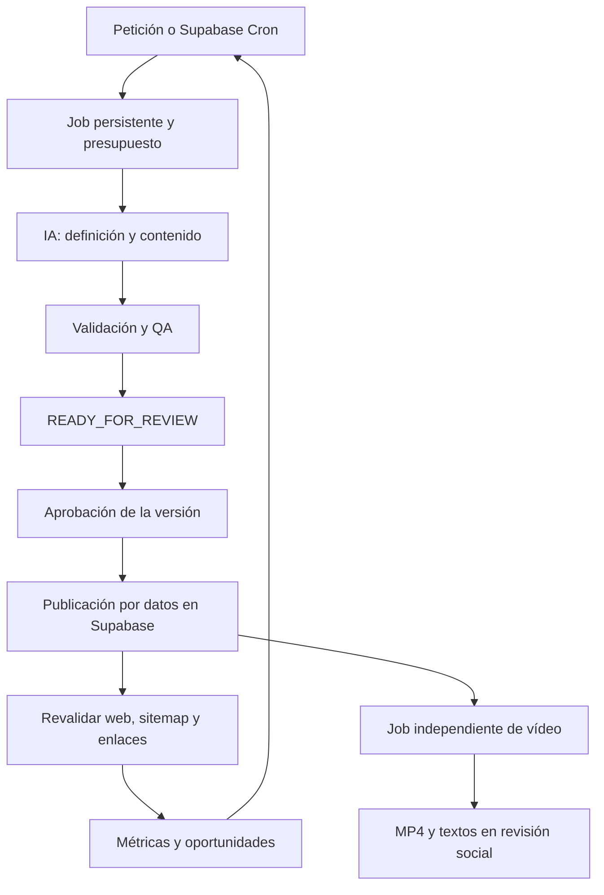

# Auditoría de herramientas y automatización

Fecha: 24 de septiembre de 2026.

Base: `PRD/PRD_Fabrica_Microherramientas_Astra6.md`, leído íntegramente. Alcance de esta entrega: verificar conexiones, identificar capacidades disponibles y recomendar incorporaciones. No constituye la implementación del producto.

## 1. Recomendación

El stack elegido permite construir la fábrica sin añadir inicialmente otro orquestador general. El mayor ahorro vendrá del motor declarativo: publicar una definición aprobada en Supabase debe actualizar la web sin desplegar código por cada herramienta (§28 del PRD).

Hay dos planos que necesitan configuración independiente:

- **Desarrollo con Codex:** skills, conectores GitHub/Supabase/Vercel, pruebas de navegador y revisión de código.
- **Operación del producto:** APIs autenticadas, jobs persistentes, workers, presupuestos, importación de métricas y auditoría. Una conexión disponible en esta conversación no proporciona automáticamente credenciales o acceso a la aplicación desplegada.

La prioridad es reutilizar las skills disponibles, establecer CI y crear unas pocas skills específicas del proyecto. Incorporar métricas y vídeo cuando exista el core. Mantener las aprobaciones previstas en el PRD.

## 2. Estado comprobado

| Elemento | Evidencia | Resultado |
|---|---|---|
| GitHub, conexión `chaplications` | Lectura autenticada de `chaplicationsApps/Project-automatic-Adsence` | Acceso confirmado; permisos declarados de administración, escritura y lectura. Repositorio público, tamaño remoto informado 0 y rama predeterminada `main`. No se probó una escritura. |
| Repositorio local | Inventario y `git status` | Al comenzar solo estaban `.git` y `PRD`; el PRD figuraba sin seguimiento. No había app, dependencias ni CI. El remoto corresponde al repositorio indicado. |
| Supabase | Listado de proyectos autenticado | Proyecto `chaplicationsApps's Project`, referencia `nzeuzxtpqrsvyvpxaugz`, estado `ACTIVE_HEALTHY`, región `eu-west-2`. |
| Supabase, estructura | Listado de tablas del esquema `public`, migraciones y Edge Functions | Los tres listados devolvieron cero elementos. No se inspeccionaron datos de usuarios ni todos los esquemas del sistema. |
| Vercel | Listado de equipos mediante conector | Respuesta sin error, pero `teams: []`. No se ha podido confirmar un equipo, proyecto ni despliegue utilizable. No equivale a demostrar que la cuenta no tenga proyectos. |
| Vinculación Vercel local | Comprobación de `.vercel/project.json` | Archivo inexistente. |
| Runtime | Comandos de versión | Node `24.13.0`, npm `11.6.2`, pnpm `11.19.0`; Git y FFmpeg disponibles. |
| CLI auxiliares | Búsqueda en PATH | No se localizaron Vercel CLI, Supabase CLI ni Docker. Esto no descarta otras instalaciones fuera del PATH. |
| GitHub CLI | `gh auth status` | No pudo leer su configuración por restricciones de acceso del entorno. El conector GitHub sí funciona, por lo que esto no bloquea la auditoría. |

Las herramientas de Supabase expuestas incluyen SQL, migraciones, tipos TypeScript, Edge Functions y advisors. Las de GitHub incluyen ramas, archivos, PRs y lectura de resultados de CI. Las de Vercel incluyen despliegues y logs, pero falta resolver el acceso a los recursos del proyecto antes de utilizarlas sobre él.

## 3. Skills que ya están disponibles

No es necesario volver a instalarlas. Su disponibilidad no implica que las dependencias del proyecto o las credenciales de producción estén configuradas.

| Área | Skills disponibles que encajan | Aplicación |
|---|---|---|
| Web | `vercel:nextjs`, `vercel:shadcn`, `vercel:react-best-practices` | Landing, catálogo, renderer y panel admin. |
| Datos | `supabase:supabase`, `supabase:supabase-postgres-best-practices` | Esquema, migraciones, Auth, RLS, índices y jobs. |
| Despliegue | `vercel:deployments-cicd`, `vercel:env-vars`, `vercel:vercel-cli`, `vercel:vercel-api` | Previews, configuración por entorno, despliegue y diagnóstico. |
| QA | `vercel:agent-browser`, `vercel:agent-browser-verify`, `vercel:verification` | Verificación funcional y visual durante el desarrollo. Complementar con pruebas reproducibles en CI. |
| IA | `openai-docs`, `vercel:ai-sdk`, `vercel:ai-generation-persistence` | Contratos estructurados, proveedor desacoplado, persistencia y trazabilidad de generaciones. No obliga a incorporar AI Gateway. |
| Operación | `vercel:observability`, `vercel:investigation-mode` | Investigar errores y despliegues; correlacionar con jobs de Supabase. |
| Skills propias | `skill-creator`, `skill-installer` | Empaquetar procedimientos repetibles e incorporar skills mantenidas por proveedores. |

Seleccionar las skills conforme a cada tarea. Mantener las decisiones del PRD: Supabase Auth, Supabase Postgres y un único dominio. Las recetas genéricas de bootstrap no justifican añadir otro proveedor de auth o base de datos.

## 4. Incorporaciones recomendadas

| Prioridad | Incorporación | Beneficio y requisito |
|---|---|---|
| Ahora | GitHub Actions + Vitest + Playwright | Lint, TypeScript, fórmulas, build, flujos admin, capturas móvil/escritorio y resultados repetibles por PR. Son dependencias/configuración del repositorio, no un nuevo conector. |
| Ahora | Skills específicas del proyecto | Convertir las reglas del PRD en procedimientos de creación, QA, revisión y publicación. Crear primero las tres del apartado siguiente. |
| Antes del lanzamiento | Codex Security | Complementar revisión de código y análisis de seguridad. Encontrado en el catálogo, disponible para instalar y no instalado al comprobarlo. Especialmente útil para fórmulas, admin e integraciones. No sustituye las pruebas de RLS. |
| Antes de IA integrada | OpenAI Developers | Ayuda con integración de APIs y configuración de claves. Encontrado en el catálogo y no instalado. El producto necesita su propio proyecto/API key y control de gasto; esta auditoría no verificó facturación ni acceso a modelos. |
| Al tener medición | MCP oficial de Google Analytics | Consultar métricas desde el agente. Es de solo lectura y requiere configuración/autorización propia; no está conectado aquí. |
| Para el dashboard productivo | GA4 Data API + Search Console API + AdSense Management API | Importaciones periódicas a Supabase y señales para priorizar herramientas. Credenciales y permisos de cada propiedad/cuenta deben configurarse para el backend. |
| En fase de vídeo | Skills oficiales de Remotion | Empezar por `remotion-best-practices`; recurrir a `remotion-render`, `remotion-captions` y `remotion-saas` según necesidad. No constan en las skills disponibles de esta sesión. |
| En fase de vídeo | Render Remotion desacoplado | Evaluar Vercel Sandbox o un worker Node dedicado. Mantener jobs en Supabase y subir el MP4 final a Storage. |
| Posterior/opcional | Duplichecker API | Requiere acceso de pago/token; mantener adaptador y flag desactivados hasta entonces. No apareció un plugin específico en la búsqueda. |

[Playwright documenta su integración con GitHub Actions](https://playwright.dev/docs/ci-intro) y [Vitest ofrece la base de pruebas unitarias](https://vitest.dev/guide/). Añadir casos de referencia independientes de la IA que genera las fórmulas.

Las [skills oficiales de Remotion](https://www.remotion.dev/docs/ai/skills) cubren composición, render, subtítulos y arquitectura. Se ha comprobado su existencia, sin ejecutar su instalación. El [MCP oficial de Analytics](https://developers.google.com/analytics/devguides/MCP) permite consultar datos, pero no cambiar la configuración de Analytics.

La búsqueda del catálogo también encontró Windsor.ai, no instalado, con acceso anunciado a GA4 y Search Console. Es una alternativa opcional para consultas desde el agente; evaluaría primero las APIs oficiales para el flujo de producción. No hace falta añadir inicialmente Linear, Notion, Slack o un orquestador adicional: GitHub y el panel admin cubren el seguimiento básico. No se encontró plugin específico de TikTok ni Duplichecker en las búsquedas realizadas; eso no impide integrar sus APIs donde el acceso y las condiciones lo permitan.

## 5. Skills propias a crear

Son propuestas, todavía no implementadas. Deben utilizar scripts y contratos reales del proyecto; no duplicar el motor de producción en instrucciones para el agente.

| Orden | Skill propuesta | Entrada y resultado |
|---|---|---|
| 1 | `microtool-authoring` | Petición → definición declarativa validada, casos de prueba, contenido, metadata y preview en revisión. |
| 2 | `microtool-quality-gate` | Versión candidata → informe de fórmulas, precisión, valores límite, contenido, SEO, accesibilidad y pruebas. |
| 3 | `microtool-release` | Versión aprobada → comprobación de QA/aprobación, publicación, invalidación de caché, comprobación pública y rollback disponible. |
| 4 | `factory-operations` | Fallo o revisión operativa → diagnóstico, reintento idempotente, conciliación de resultados externos y control de presupuesto. |
| 5 | `social-video-package` | Herramienta publicada → guion, vídeo, subtítulos, caption y preview social listo para aprobación. |
| 6 | `growth-review` | Métricas con procedencia/cobertura → oportunidades y mejoras priorizadas; no decidir con muestras mínimas. |

Versionarlas dentro del proyecto cuando los contratos básicos existan. Codex admite [skills locales en `.agents/skills`](https://learn.chatgpt.com/docs/build-skills). Un `AGENTS.md` breve puede señalar el PRD, los comandos de verificación y los límites de cada procedimiento.

## 6. Flujo operativo propuesto

Para cambios de código y herramientas custom: rama → CI → preview Vercel → revisión → merge → producción. Para herramientas declarativas: versión en datos → QA → aprobación → publicación, sin un redeploy por herramienta.

[Supabase Cron](https://supabase.com/docs/guides/cron) permite ejecutar SQL o invocar funciones mediante HTTP. Mantenerlo como despertador breve. [Supabase Queues](https://supabase.com/docs/guides/queues) es una opción para transporte durable sin añadir un servicio externo; conservar una tabla de jobs para estado de negocio, costes y auditoría. La entrega de mensajes no elimina la necesidad de idempotencia ante efectos externos y reintentos.

Las tareas programadas de Codex pueden ayudar con revisión de CI, mantenimiento y análisis. Para tareas locales, la documentación exige mantener el equipo encendido y la app en ejecución. El scheduler de la fábrica debe residir en la infraestructura del producto. [Documentación de tareas programadas](https://learn.chatgpt.com/docs/automations?surface=app).

## 7. Hallazgos que afectan al PRD

### TikTok: no asumir que una app privada superará Direct Post

El §21 recoge auditoría, privacidad y consentimiento, pero falta una limitación decisiva: las directrices de Direct Post excluyen las utilidades privadas destinadas a subir contenido a las cuentas del desarrollador o su equipo. Por el uso descrito, existe un conflicto potencial con ese requisito. No se puede tratar la auditoría como un trámite garantizado.

Mantener generación de MP4 y textos, preview y descarga. Evaluar un proveedor de publicación autorizado que admita el caso de uso o el flujo permitido por TikTok, antes de comprometer autopublicación. Sin auditoría, Direct Post está restringido a visibilidad privada; la UX también exige selección de privacidad y consentimiento. [Directrices oficiales de TikTok](https://developers.tiktok.com/docs/en/content-sharing-guidelines).

### Hosting comercial

El plan Hobby de Vercel está limitado a uso personal no comercial. Para este producto monetizado se debe presupuestar un plan que admita uso comercial. No se ha verificado el plan actual de la cuenta. [Plan Hobby](https://vercel.com/docs/plans/hobby).

### Vídeo sin bloquear peticiones web

Remotion documenta [render en Vercel Sandbox](https://www.remotion.dev/docs/vercel-sandbox), con ejecución desacoplada y consulta de progreso. Es una opción compatible con mantener Vercel como proveedor, pendiente de validar coste y capacidad. La plantilla documentada usa Blob; adaptar el resultado a Supabase Storage requiere implementación. No ejecutar el render pesado dentro del dispatcher de Supabase o una petición web normal.

### Métricas con cobertura explícita

- **GA4:** un Measurement ID sirve para instrumentación, pero no autentica la extracción de informes. La Data API requiere proyecto, API habilitada y acceso a la propiedad. Definir `tool_slug` como dimensión adecuada y normalizar URL ↔ herramienta. [GA4 Data API](https://developers.google.com/analytics/devguides/reporting/data/v1/quickstart).
- **Search Console:** importar consultas, páginas y rendimiento; la API no garantiza todas las filas. Un registro ausente no significa cero tráfico. [Search Analytics](https://developers.google.com/webmaster-tools/v1/searchanalytics/query).
- **Indexación:** automatizar sitemap y observación. La Indexing API está restringida a ofertas de empleo y emisiones en directo con los tipos indicados por Google; no aplicarla a estas calculadoras. [Uso de Indexing API](https://developers.google.com/search/apis/indexing-api/v3/using-api).
- **AdSense:** existe `PAGE_URL`, pero el desglose está limitado a páginas populares, umbral de impresiones y últimos 30 días. Guardar ingresos medidos, estimados o no disponibles, sin repartir totales como si fueran mediciones exactas. [Dimensiones de la API](https://developers.google.com/adsense/management/metrics-dimensions), [límites del desglose por página](https://support.google.com/adsense/answer/11988478).
- **Aprobación AdSense:** la API permite consultar el estado del sitio; no aprobarlo. Mantener el flag de anuncios condicionado a la preparación real y al consentimiento. [Recurso Sites](https://developers.google.com/adsense/management/reference/rest/v2/accounts.sites).
- **Originalidad:** confirmar contrato y acceso de Duplichecker mediante prueba autenticada al activar el módulo. Mantener reintentos acotados y estado pendiente ante indisponibilidad. [API Duplichecker](https://www.duplichecker.com/api-documentation).

### Contratos internos para automatización fiable

1. Separar estados de herramienta, job, vídeo y publicación social; normalizar `review`, `WAITING_APPROVAL` y `READY_FOR_REVIEW` (§§8, 10–11).
2. Vincular aprobación y QA al identificador/hash de la versión exacta. Una edición posterior invalida el visto bueno (§§13, 28).
3. Incorporar toma atómica de jobs, vencimiento de bloqueos, recuperación de workers y conciliación antes de repetir llamadas externas (§12).
4. Reservar presupuesto antes de llamar a IA/render para impedir que jobs concurrentes excedan el límite diario (§32).
5. Usar casos matemáticos de referencia y propiedades independientes; la misma IA puede equivocarse de forma coherente en fórmula y test (§§23, 37, 40).
6. Determinar un canal inicial de alertas, con deduplicación. El panel admin basta al comenzar (§31).
7. Tratar `noindex` como control de indexación; las previews que contengan información privada requieren además control de acceso.

## 8. Orden recomendado de ejecución

1. Resolver la visibilidad del equipo/proyecto Vercel: comprobar cuenta y autorización, obtener identificadores reales y vincular el repositorio. Verificar el plan para el uso comercial previsto.
2. Crear el plan de implementación y desarrollar Fases 0–1: app, Supabase Auth/RLS, migraciones versionadas, CI, motor seguro y las tres herramientas seed.
3. Completar Fase 2: versiones, revisión, publicación y rollback. Crear las tres primeras skills propias sobre estos contratos.
4. Integrar IA estructurada con presupuesto, reparación acotada y casos de prueba independientes. Los modelos concretos se eligen al implementar, sin acoplar el proveedor al nombre del agente que desarrolla.
5. Configurar GA4/Search Console y preparar AdSense/CMP con las autorizaciones reales. Incorporar los adaptadores de informes.
6. Añadir las skills Remotion, elegir render worker y producir el paquete social. Resolver el canal permitido de TikTok antes de implementar envío público.
7. Activar la fábrica diaria únicamente tras validar calidad y costes: inicialmente un candidato listo para revisión por ejecución diaria, sin autopublicación.

El dominio definitivo, la estética, TTS y horarios no bloquean el core (§45). Los conectores de métricas, Duplichecker, TikTok y el vídeo pueden incorporarse por fases.

## 9. Acciones de esta auditoría

Se realizaron lecturas locales, comprobaciones autenticadas de metadatos, búsquedas de plugins y consultas de documentación oficial. Se creó este informe. No se instalaron skills/plugins, ejecutaron migraciones, crearon proyectos remotos, publicaron herramientas ni activaron tareas programadas. Codex Security quedó recomendado para instalación; su conexión sigue sin verificarse.

No había aplicación ni suite de pruebas que ejecutar. La verificación realizada corresponde al inventario y a las capacidades documentadas, no a un flujo productivo implementado.
